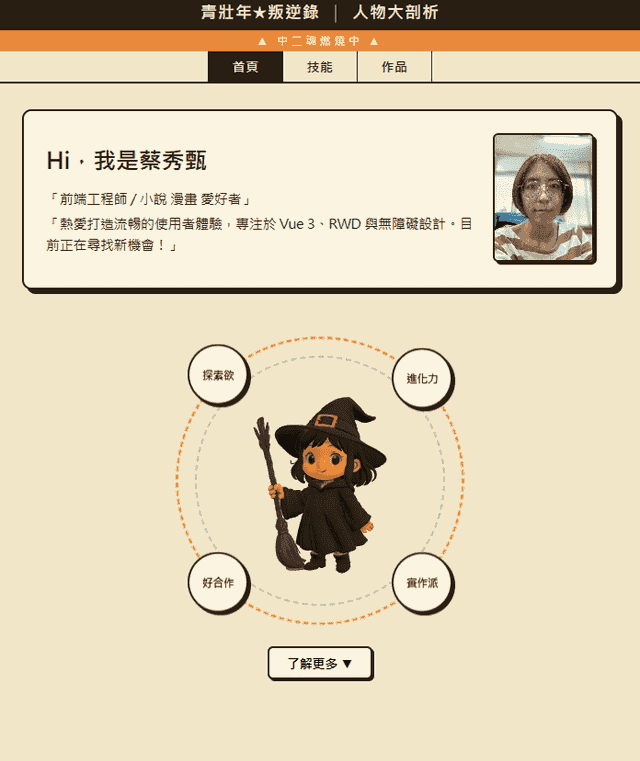

<div align="center">

# 🎨 個人作品集網站 · Portfolios Web

以 **Vue 3 + Vite** 打造的個人作品集,集中展示個人介紹、技能與多個前端練習作品。

[](https://vuejs.org/)
[](https://vite.dev/)
[](https://router.vuejs.org/)
[](https://pinia.vuejs.org/)
[](https://emily100390.github.io/portfolios-web/)

### [🔗 線上預覽 Live Demo](https://emily100390.github.io/portfolios-web/)

</div>

---

## 📸 預覽

<div align="center">



</div>

---

## ✨ 功能特色

- 🧩 **組件化架構** — 導覽列、個人卡片、技能卡片、作品卡片皆獨立為可複用組件
- 🧭 **路由導航** — 使用 Vue Router 切換首頁、技能頁、作品列表與作品詳細頁
- 🗂️ **狀態管理** — 以 Pinia 管理共享狀態
- ❤️ **作品收藏** — 作品列表可即時收藏 / 取消,並統計收藏數量
- 📱 **RWD 響應式設計** — 支援桌機與手機,並提供右下角浮動導覽按鈕
- 🚀 **多個獨立 Demo** — 內建任務管理、天氣查詢、城市旅遊、神奇生物圖鑑等實作作品

---

## 🛠️ 技術棧

| 類別 | 使用技術 |
|------|----------|
| 前端框架 | Vue 3 (`<script setup>`) |
| 建構工具 | Vite |
| 路由 | Vue Router |
| 狀態管理 | Pinia |
| 3D / 其他 | Three.js、Web Audio API、Fetch API |
| 部署 | GitHub Actions + GitHub Pages |

---

## 📁 專案結構

```text
portfolios-web/
├── public/                  # 靜態資源與獨立 Demo (不經 Vite 編譯)
│   ├── city-travel/         # 城市旅遊導覽 Demo
│   ├── models/              # 3D 模型資源
│   ├── todo.html            # 任務管理 App
│   ├── weather.html         # 天氣查詢儀表板
│   ├── biology.html         # 神奇生物圖鑑
│   ├── color-test.html      # 色彩敏銳度測試
│   ├── member-card.html     # 會員資料小卡
│   └── favicon.ico
├── src/
│   ├── components/          # 可複用組件
│   │   ├── NavBar.vue       # 導覽列
│   │   ├── FloatingNav.vue  # 浮動導覽按鈕
│   │   ├── ProfileCard.vue  # 個人介紹卡片
│   │   ├── SkillCard.vue    # 技能卡片
│   │   ├── ProductCard.vue  # 作品卡片
│   │   └── CharacterSection.vue
│   ├── views/               # 頁面級組件
│   │   ├── HomeView.vue           # 首頁 (/)
│   │   ├── SkillsView.vue         # 技能頁 (/skills)
│   │   ├── ProjectsView.vue       # 作品列表 (/projects)
│   │   └── ProjectDetailView.vue  # 作品詳細 (/projects/:id)
│   ├── router/index.js      # 路由設定
│   ├── stores/              # Pinia store
│   ├── App.vue              # 根組件
│   └── main.js              # 進入點
├── index.html
├── vite.config.js
└── package.json
```

---

## 🚀 開始使用

### 環境需求

- Node.js `^20.19.0` 或 `>=22.12.0`

```sh
# 1. 安裝相依套件
npm install

# 2. 啟動開發伺服器 (熱重載,預設 http://localhost:5173)
npm run dev

# 3. 打包正式版
npm run build

# 4. 預覽打包結果
npm run preview
```

---

## 📦 部署

每次 push 到 `main` 分支後,**GitHub Actions** 會自動執行 `npm run build`,並將 `dist/` 推送到 `gh-pages` 分支供 GitHub Pages 提供服務。

> ⚠️ `vite.config.js` 中設定了 `base: '/portfolios-web/'`,因此部署路徑會帶有此前綴。若 repository 名稱變更,請同步調整。

---

## 🎨 作品一覽

| 作品 | 說明 | 技術 |
|------|------|------|
| 任務管理 App | 新增 / 刪除 / 拖曳排序,資料持久化於 localStorage | `Vue 3` `拖曳排序` `localStorage` |
| 天氣查詢儀表板 | 串接 Open-Meteo API,即時天氣與五日預報 | `JavaScript` `Fetch API` `CSS Grid` |
| 神奇生物圖鑑 | 報紙剪報風主題館,含表單、評分與蓋章音效 | `Vue 3` `Web Audio API` `RWD` |
| 城市旅遊導覽 | 多頁式旅遊導覽,Vue Router + Pinia | `Vue 3` `Vue Router` `Pinia` |
| 色彩敏銳度測試 | 找出色塊中不同顏色的小遊戲,難度漸增 | `JavaScript` `HTML` `CSS` |
| 會員資料小卡 | 即時雙向綁定,動態預覽個人化會員卡 | `Vue 3` `HTML` `CSS` |

---

<div align="center">

**emily100390** · [GitHub](https://github.com/emily100390/portfolios-web)

⭐ 如果這個專案對你有幫助,歡迎給個 Star!

</div>
